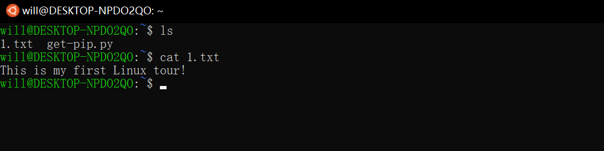

# 【学习笔记 1】Linux 环境配置与flask库安装 

[参考链接](https://www.linuxprobe.com/win10-linux-systeam.html)

## 1. 安装Ubuntu 
win10环境下，开启子系统服务，启用开发人员模式;   
在Microsoft Store 下载免费的Ubuntu , 安装即可。  

### 1.1 开启windows服务
 

在控制面板 -> 程序和功能 -> 启用和关闭windows功能： 勾选windows子系统选项  

`win + I` 进入 `设置 -> 更新与安全 -> 开发人员选项`  打开开发人员模式  

## 1.2 下载 Ubuntu系统

在Microsoft Store 下载免费的 Ubuntu   

第1个为正式版，不提供长期更新；
第2/3为LTS版本，是长期支持并提供更新的版本。  
可根据自己喜好选择。

## 1.3 安装成功

安装成功后, 以应用的形式出现在开始菜单  

点击运行，设置账户、密码, 开始第一次的Linux 之旅 ~   

## 1.4 设置root账户密码 

Ubuntu 在安装时未设置root 密码, 在使用 `su root`切换至root用户时会提示输入密码。  

通过 `sudo passwd root` 命令修改  

**Note:** Linux中的密码是密文输入，没有`*` 号，光标不动。  

## 2. 测试python环境和安装 flask库  

### 2.1 python3 ≠ python 

windows 中只配了 python3 的环境, 可直接使用 `python` 命令(无法识别 `python3`)  

  

安装的新版 `Ubuntu`，自带 python3 环境  

 

### 2.2  pip 命令丢失

windows 命令行窗口 `pip` 与 `pip3`等价

`pip command not found `     
  
	// 手动安装 pip3
	wget --no-check-certificate  https://pypi.python.org/packages/source/p/pip/pip-9.0.1.tar.gz#md5=3a73c4188f8dbad6a1e6f6d44d117eeb
	tar -zxvf pip-9.0.1.tar.gz 
	cd pip-9.0.1
	python3 setup.py build
	python3 setup.py install

手动安装 **duck不必**  
安装python3的时候会自动安装pip3, 可在 路径`"home\will\.local\bin"`或`"home\will\.local\lib\python3.x"`下查看  

【问题】
为什么 `pip`命令和 `pip3`命令有时无法识别(切换root用户后,pip not found, 再次切换回will 用户, pip not found )

  

重启 bash 后，命令正常  ` pip = pip3`

  

【解决方法】  

-  尝试1：通过查看不同用户下的 PATH   

分别在当前用户和root用户下执行 `echo $PATH`, 未解决问题  

- 尝试2：在root用户下重新导入 pip 

执行 `python3 get-pip.py `命令,  `get-pip.py` 通过 `wget https://bootstrap.pypa.io/get-pip.py` 方式获取  
  
 

**【小结】**  
虽然解决了`pip`命令丢失的问题，但具体原因依然不明，mark !!!

### 2.3 安装 flask 库  

测试成功  

## 3. 编写简单的web程序  

[一篇超详细的flask学习博客](https://blog.csdn.net/sinat_38682860/article/details/82354342?ops_request_misc=%257B%2522request%255Fid%2522%253A%2522162148005216780262560341%2522%252C%2522scm%2522%253A%252220140713.130102334..%2522%257D&request_id=162148005216780262560341&biz_id=0&utm_medium=distribute.pc_search_result.none-task-blog-2~all~sobaiduend~default-7-82354342.pc_search_result_hbase_insert&utm_term=python+flask%E6%A1%86%E6%9E%B6&spm=1018.2226.3001.4187)  

	# serve.py
	# 导入Flask包
	from flask import Flask
	# 创建实例 
	app = Flask(__name__)
	
	# 装饰器, 定义route 规则 
	@app.route('/')
	def hello_world():
	    return 'Hello World!'
	# 本文件为程序入口 
	if __name__ == '__main__':
	    app.run()

**Note:** 当`serve.py` 作为函数被调用时(程序入口非当前文件)，`__name__`的值为文件名`'serve'`

命令行使用 `curl`测试  

